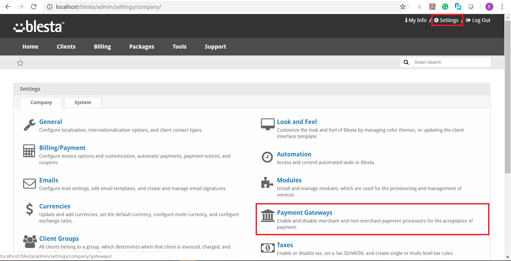

# Rave Blesta Plugin #

This is a payment Module for BLESTA that allows you to accept payments using Rave By Flutterwave

## Requirements ##

* Blesta installation.
* Rave Account
* PHP 5.2.0 or greater
* Blesta 3.0.0 or greater

## Description ##

Accept Credit card, Debit card, Mobile Money, Pay with Barter and Bank account payment directly on Blesta with the Rave payment gateway.

Signup for a Live account [here](https://rave.flutterwave.com)
Signup for a Test account [here](https://ravesandbox.flutterwave.com)

Rave is available in:

* __Nigeria__
* __Ghana__
* __Kenya__
* __South Africa__
* __Uganda__
* __Tanzania__
* __USA__

## Install ##

1. Download plugin.

2. Unpack all files from ```Blesta-rave-gateway``` and upload the content into ```blesta\components\gateways\nonmerchant``` folder of your Blesta installation.

3. In your Blesta Admin Dashboard, click ```Settings``` on the top right navigation and choose ```Payment Gateways```.

4. choose **Available** from ```Payment Gateways``` section, it will list all available gateways. 

5. Scroll to ```Rave``` and click on the **Install** button. 

6. Configure your account by filling all the fields. 

  >Your ```Public and Secret Keys``` can be found in your [Rave dashboard](https://support.flutterwave.com/article/138-my-api-keys). Do not forget to check the checkbox for Live transaction.


>Test Card

```bash
5438898014560229
cvv 564
Expiry Month 10
Expiry Year 20
Pin 3310
otp 12345
```

>Test Bank Account

```bash
Access Bank
Account number: 0690000004
otp: 12345
```

```bash
Providus Bank
Account number: 5900102340, 5900002567
otp: 12345
```

> Contact [hi@flutterwavego.com](hi@flutterwavego.com) if you have any issues.
